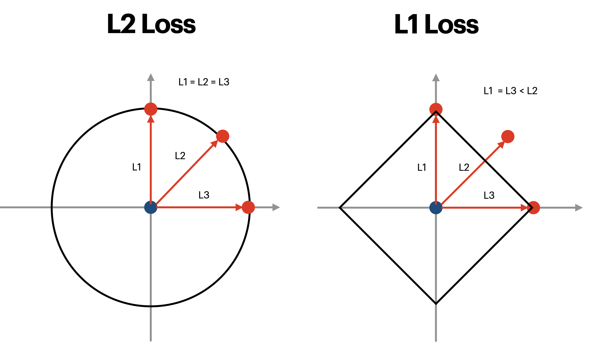
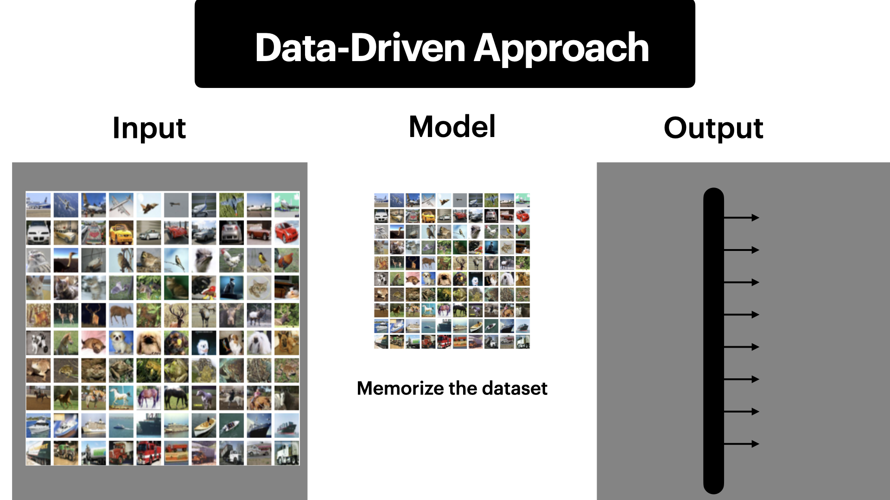
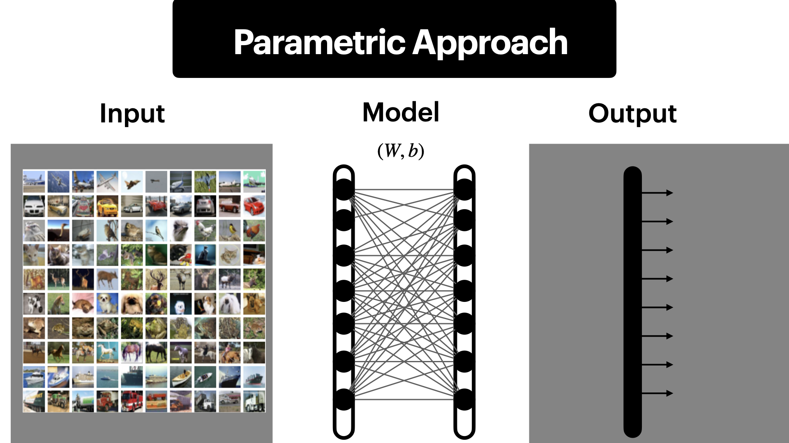

## Core Tasks in Comptuer Vision

- Image Classification
- Semantic Segmentation
- Object Detection
- Instance Segmentation

The problem in computer vision is that when reading in images to computer, what computer see is actually color bits representing RGB value. So, a slight change in the image can make huge different. That is called the semantic gap.

## Challenges

Below are the chanllenges that could change the value of the image even if the object in the image is the same.
- ViewPoint variations (Camera View point change)
- Illumination (Lighting condition of image)
- Deformation (Shape of Object in the image changed)
- Occlusion (background object get blocked by object in front)
- Background Clutter (Color of object the same as background, eg. fox in snow)
- Intraclass variation (Various intra class in object. eg. bulldog and akita)

## Attempts have been made

Input : Image
Process : Find edge, Convolute with template
Output :  Match -> is cat, else --> not cat.

### Data-Driven Approach
- Collect Datasets.
- Use ML to train a classifier (Data Model).
- Evaluate with ML model.

#### 1. Use NN (Nearest Neighbour)
Given a test image, compare it with all images from the train dataset, find the closest one, its label is the test label. 
Loss function : \\(L = \sum_p |I_1^P - I_2^P|\\), 
Just subtract two images and sum the difference.

#### 2. Use KNN (K-Nearest Neighbour)
Instead of just the closed one, it select the k closed one. Majority of the k label is the test label. For example, Nearest Neightbour would be 1-NN, where the number of closest neighbour is set to 1.

## L1 Loss and L2 Loss

As shown in the figure above, 3 elements with respect to the target will get difference loss value if different loss function was used.

In the course, he mentioned that if the input data is dimension aware, it should use L1 Loss. But commonly, most people choose L2 as their loss. Cause the relative distance between two points is the same in L2 Loss. 
[Intuiative Playground for KNN by Standford](http://vision.stanford.edu/teaching/cs231n-demos/knn/)

## Setting Hyperparameters

In the above case, k-value is the hyperparameters, we won't know which k-value will give out the best performance. So, we will divide the dataset to give us which hyperparameters should be used.
- Train Dataset : The dataset to train our model.
- Validation Dataset : The dataset used for validation.
- Test Dataset : The dataset used for evaluation of model. 

If we split the dataset in such three fold, we can train the model, improve model by testing different hyper parameters on validation set, and test and give performance of the model on test dataset. 
Backthen, when there are no much datasets available, we use cross-validation method, which split data into folds, train and validation on each fold and average the result. It is not much used in deep learning nowaday. Just because there is no need.

> Note: In real life, KNN on image will never be used. It is too slow on test time, memory inefficient and Loss algorithm is not good. 

## Linear Classification

### Parametric Approach
- Collect Datasets.
- Use ML to train a classifier (Parametric Model).
- Evaluate with ML model.

The difference between data-driven approach and parameteric approach is that the model in previous one try to memorize the dataset, while the later train the parameters \\((W, b)\\) in the model. This way, the model is robust to inputs and the model can be trained to get better performance with more dataset.

## Interpreting a Linear Classifier
The course present an interesting way to interpret the model.
