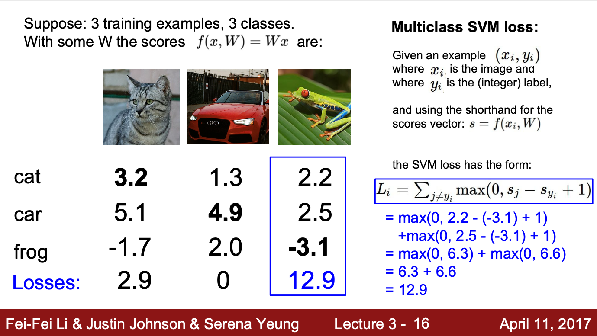

## Loss Function

In the previous lesson, when we use a KNN model, we use L1 distance or L2 distance to measure the similarity between two images. The lower the value, the similar the two images are. It, in other way, can be seems as the loss function between two element, large the value mean larger loss. 
In this lecture, different loss functions will be introduced. In the esscence, loss value tell us how badly the model is performing. The loss function take in the output from the model and compare it with the training label. If similar, loss value is small, if not, loss value is large. 
General loss function can be expressed as: 
\\(L = \frac{1}{N} \sum_i L_i(f(x_i, W), y_i)\\) 
In the lecture, one particular loss was introduced, even thought it is not of much used in later tutorial. 
Multi-class SVM Loss (Hinge Loss): 
\\(L_i = \sum_{j\neq y_i} max(0, s_j - s_{yi} + 1)\\) 

Basically, the loss is computed from the non-normalized probability distribution of the model output. For each class, it calculate the relative difference between the true label and other class probability. The main drawback is because it is non-normalized, the loss can be hard to controlled(if the model output probability is ranging into large value), it can state problem. In the above case, the loss value will not change even if the probabily for car input is drop to `3.0`.

Q1. What happened to loss if the car scores changed a bit? 
My Ans: The car score can drop to `3.0` and not make loss change.

Q2. What is the min/max possible loss? 
My Ans: min : 0, max : can be any to infinity.

Q3. At initialization, W is small, so all \\(s\approx 0\\). What is the loss? 
My Ans: There will still be some loss, defined by biased term `+1` in loss function. So, if it is 10 class classification, it will probably get loss value of `10` in the very first iteratin.

Q4. What if the sum was over all classes? (including \\(j=y_i\\))
My Ans: question not quite understand.

Q5. What if we used mean instead of sum? 
My Ans: There will still be loss when there is loss. The value will just be smaller.

Q6. What if we use : \\(L_i = \sum_{j\neq y_i} (max(0, s_j - s_{yi} + 1))^2\\) 
My Ans: There will still be loss when there is loss. The value will just be bigger. And because there is no negative loss value, so, it will just simple make loss value bigger.

In the presentation also stated that, hinge loss is no good, because it is not normalized. weights value does not need to be unique to get loss to zero.

## Regularization

Regularization in the model take the effect of making the model less variance, prevent over-fitting. By adding penelties to the loss function, it essentially turn of some of the neurons, making the model less complicated.

> **Occam's Razor**: 
> Among competing hypotheses, the simplest is the best.

It get the following equation: 
\\(L = \frac{1}{N} \sum_i L_i(f(x_i, W), y_i) + \lambda R(W)\\) 

Typically used regularization methods are: 
- L1 and L2 regularization (Weight Decay).
- Dropout / DropBlock.
- Batch Normalization, Stochastic Depth.
- Data Augmentation.

### L2 Regularization (Weight Decay)

It get the following equation: 
\\(L = \frac{1}{N} \sum_i L_i(f(x_i, W), y_i) + \lambda \sum_k \sum_l W^2_{k, l}\\) 
To reduce loss value, the function need to reduce the weight value, result in turning some of the weight neuron off, resulting in simpler model.

## Softmax Classifier (Multiclass Logistic Regression)
Remember the linear logistic regression which we use sigmoid function as activation, get output from sigmoid and calculate loss with \\(-\hat{y}log(y)\\). That is for binary classification.

While in multi-class classification, we will use Softmax to normalize the output from model, and calculate loss with \\(-\hat{y}log(y))\\), same as linear logistic regression. This solve the problem with hinge loss, as it does not consider normalizing the output from the model first to calculate the loss. The softmax function is as following: 
\\(P(Y=y_i|X=x_i) = \frac{e^s k}{\sum_j e^s k}\\), it normalized the output from model.

Q1. what is the min/max possible loss \\(L_i\\)? 
My Ans: min: very small, but never 0. max : not very large. for 10 classes, max loss would be around 60.

Q2. At initialization, W is small, so all \\(s\approx 0\\). What is the loss? 
My Ans: since all s is the same, for 10 classes, it will get probability of 0.1 for each class. The loss might be 1, if log is based 10 and only consider one class for loss. But I guess, the loss look at all 10 classes when calculating loss, Check needed.

Short Exercise:

|Assume Score|Class|Hinge Loss|Softmax Loss|
|:---|---:|---:|---:|
|[10, -2, 3] |0|0|median loss|
|[10, 9, 9] |0|0|largest loss|
|[10, -100, -100] |0|0|smallese loss|

### Recap:
We learnt the score function and loss function. Now we want to use loss function to update the weight value. But how? This step of taking the loss value to update the weight to get less loss is called optimization. Optimization is done by doing backward progation throught the network, which basically is chaging the weight value to reduce the loss.
> Note: You may not understand how this work, cause this course focus on computer vision. Later, I will post more note about how model is updated to get low loss.

When doing gradient update, there are basically two ways:
- Numerical Gradient, by changing the small amount of independent variable (W in this case), see how that change in dependent variable (L in this case).
    - slow, inefficient
- Analytic Gradient, by using equation, we can calculate the gradient from the input.
    - fast, exact.
    
## Image features
Image in a computer can take large space. And thus using it for learning also take more computation power. So, instead of just using image as the input, we often tend to change the image into different features, like simple histogram of the image, HOG(Histogram of Oriented Gradient) of the image or Bag Of Words, and etc. These methods greatly reduce the input size and computation needed while not losing any information for the image.