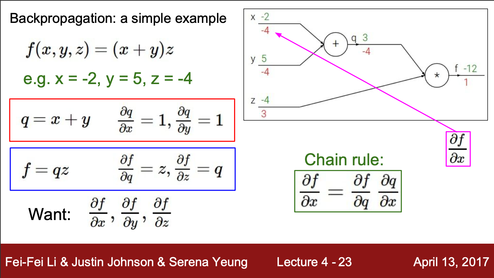
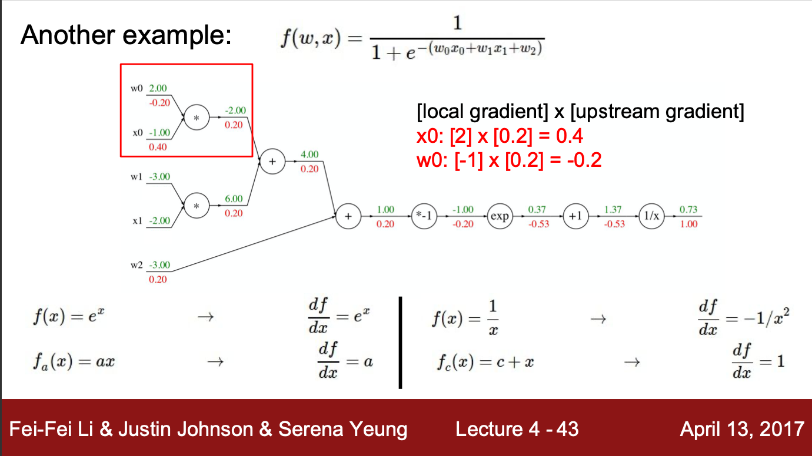
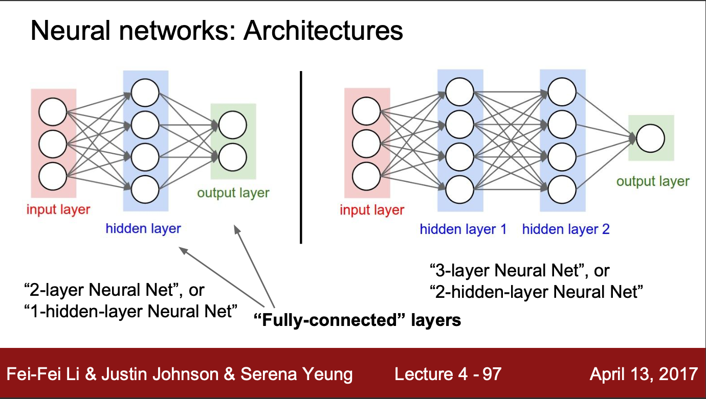

## Backpropagation

> recursive application of the chain rule along a computational graph to compute the gradients of all inputs/parameters/intermediates
> `Lecture Note`.

The basic vanilla model optimization method is called gradient descent, where the gradient of loss respect to weight get descent everytime we update the model parameters. The equation is as follow.
$$W_{t} = W_{t-1} - \alpha \frac{dL}{dW_{t-1}}$$
In code:
```python
# vanilla Graident Descent
while True:
    # loss_fun to calculate loss from data with respect to weigth.
    weight_grad = evaluate_gradient(loss_fun, data, weight) 
    weight += -step_size * weight_grad
```
In mathematical term, this is called *analytic gradient*. They provide an example backpropagation process with simple computational graph.



From the graph, we can see the result gradient from two simple operations, addition and multiplication. Addition in local gradient backpropagation will simply return the previous gradient. While in multiplication, local gradient is the same as the other input. So, imagine, normally, we would calculate $dW_{t}$, which will have the graident of $X_{t}*dX_{t+1}$.
If we use **Relu** as the activation function in the intermediate layers:<br>

| $X$ | $W$ | $Relu(W^T X)$ | $dW_{t}$ |
|---|---|---|---|
|+ | + | Positive| 1 |
|+ | - | Negative| 0 |
|- | + | Negative| 0 |
|- | - | Positive| 1 |

`1` in above table result in $X_t * Relu(W^T X)$ of gradient.

### Local Gradient

When the model get too deep, many layers, it is hard to calculate all the computation flow. Instead, we calculate for each local gradient and compile them. Local gradient have the equation of $\frac{d relu(W^T * X)}{dX}$ for each weigth parameter.



As mentioned earlier, add gate will result in the previous gradient value, multiplication gate will swap the gradient with another input.So
- Add Gate : Gradient Distributor
- Max Gate : Gradient Router
- Mul Gate : Gradient Switcher

### Size of Gradient

The size of the graident is the same or larger than the size of weight parameters. Cause it also have to store the gradient value of the output from the activation function.

### Model Architecture

In the deep learning papers, we often see the authors describe their layers as 34 layers, 56 layers, and so on, often this refer to how many weight layers exists in the model.

