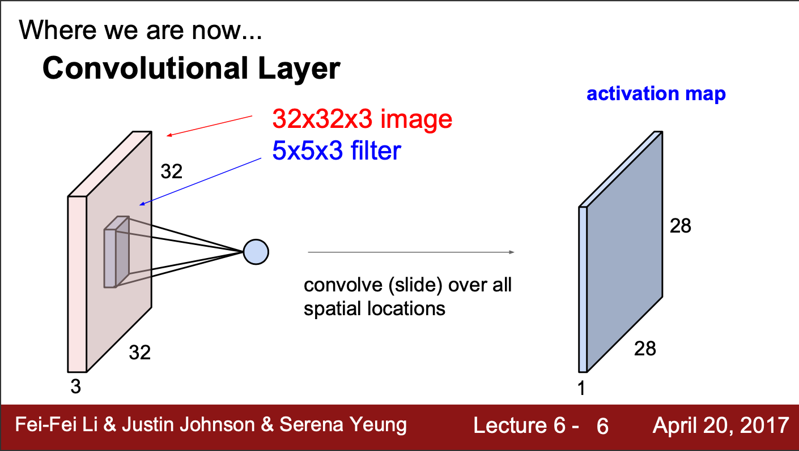
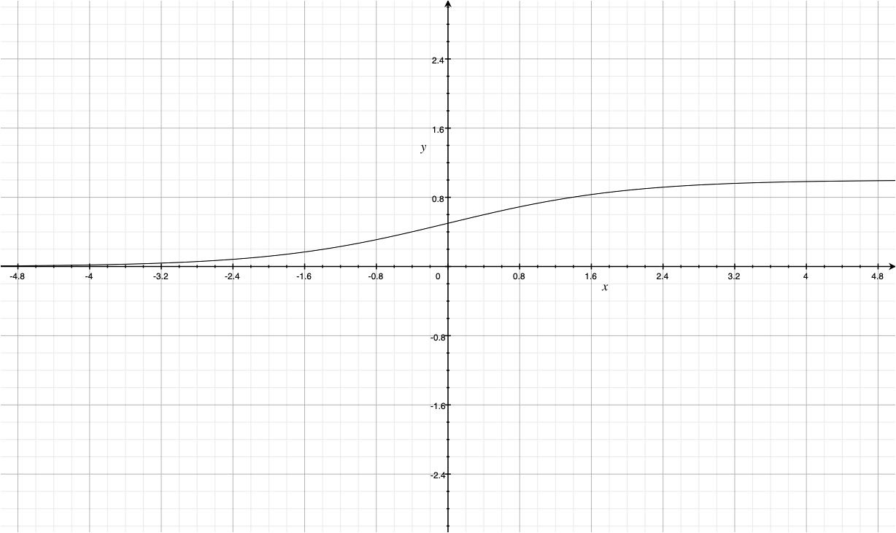
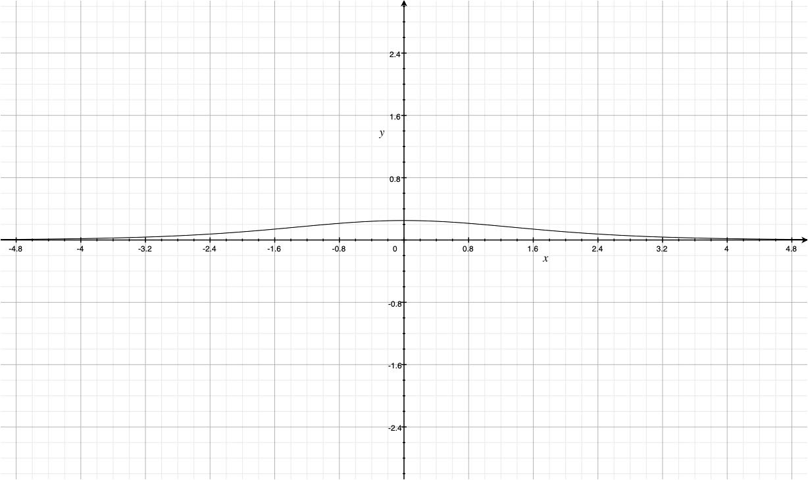
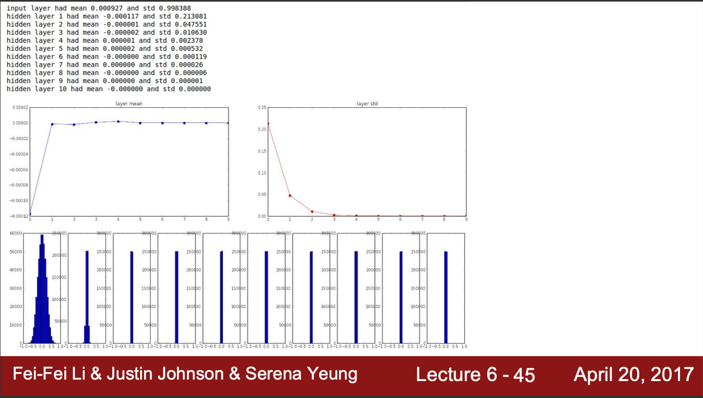
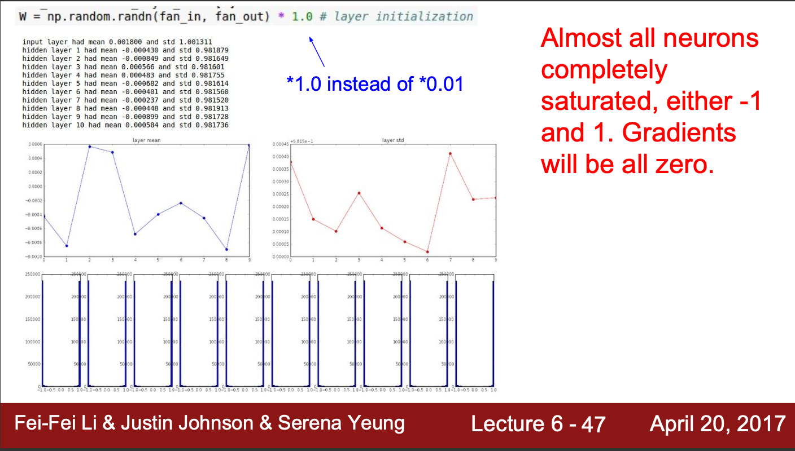

## Recap

In The previous lesson, we introduced the basic operation of convolution. Because the input is normalized between (-1, 1), so the effect of filter on the input will result on activating the area where the input is similar to the filter. That is the effect of convolution.

## Training Model

The overall process of getting a DNN model include, collect data, construct model, train model and evaluate model. In the training part, we have to optimize the model to get better performance. The esscent of optimizing the model is update the weight parameter to get lesser loss value. This is done by optimizer. In the last time, we introduced vanilla gradient descent. By the rate of update according to the use of dataset, it can be further named as:

|Name|Update per datapoint|Number of datapoints in dataset|
|---|---|---|
|SGG (Stochastic Gradient Descent | Update weight for each data point) eg. 1| 100,000 |
|Mini-Batch GD (Mini-batch Gradient Descent | Update weight for small batch of data point) eg. 100 | 100,000|
|GD (Gradient Descent | Update weight once for all data point) eg. 100,000 | 100,000|

There are many more optimizer nowaday and most popular one would be **Adam** Optimizer, which will be introduced later.

## Activation Functions

### Sigmoid Function
Sigmoid function, also called Logistic function, have a "S" continuous function with output range from 0 to 1. The equation for the sigmoid function is as following:
$$\sigma(x) = \frac{1}{1 + e^{-x}}$$
and the derivative(graident) of sigmoid function is:
$$\sigma(x)[1-\sigma(x)]$$

3 Problems with Sigmoid
- Saturated neurons kill the graident.
- Sigmoid output are not zero center.
- exp() function is expensive to calculate.

Since sigmoid output are always positive(not zero center), if we concatenate many cells and its input are from another cell output, it will only get positive value as input. That is why sigmoid, not zero center is bad.

Instead, we will use `tanh` activation, which have the advantages of zero center and keep range between (-1, 1). But it still get saturated at the end and kill the gradient.

### Relu (Rectified Linear Unit)
Most popular activation function now is `Relu` activation, which is simple, and not saturate at (+) region. And practice show it converges much faster than other activation functions.

The equation of `Relu` is as follow:
$$Relu(x) = \begin{cases} x & \quad \text{if x>0} \\ 0 & \quad \text{if x < 0}\end{cases}$$
And the differentiation equation is as follow:
$$Relu(x) = \begin{cases} 1 & \quad \text{if x>0} \\ 0 & \quad \text{if x < 0}\end{cases}$$
Althought relu also saturate at $-$ size of the output, it is much easier to compute and simple, and it works. So, in the hidden layers of Neural Network, we often use `Relu` as the first choise for activation function.

Aside from `Relu`, there are many other activation functions:
- Leaky Relu  : $f(x) = max(0.01x, x)$
- Exponential Linear Unit 
- Maxout Neuron  : $max(w^T_1x + b_1, w^T_2x + b_2)$

## Data Preprocessing

This include Normalization of data, dimemsion reduction with PCA or T-SNEA if needed and other feature engineering method.

## Weight Initialization

Q: What will happen if all weight is initialized with 0? 
Cause there is loss value, there will the gradient flow. But, casue the input value is all zero, coming from previous input * weight, it the gradient flow will get kill and the model will not get update.

The above figure show the output filter from initializing the model with random values of $W = 0.01 * np.random.randn(D, H)$. Since the output value range from -1 to 1 and the weight value is small, the output is getting smaller and smaller everytime. And the result in output getting closer to 0. The main problem is *weight initialization* value is too small. What happen if we increase that random initialization value $W = 1 * np.random.randn(D, H)$.

To solved this, we generally use `Xavier initialization` method.

## Batch Normalization

The idea is that we want middle layers in network to get gaussian distribution too, so we will just get output from activation map and normalize its value. And that is called Batch Normalization. It get the following advantages:
- Improve gradient flow through the network
- Allow higher learning rate
- Reduce strong dependence on weight initialization
- A little regularization effect.

## Babysitting Training
Tips
- Always do sanity check of model architecture before training.
- When first train, train a small portion and make sure the model can overfit. If so, retrain with all dataset.
- When training, set learning rate to low but not too low and observe result.

## Hyper-parameters Optimization

### Cross Validation Strategy

Coarse -> Fine 
First, try just a few epoch with certain hyper parameters, then try another. If the duration of one hyperparameter getting to converge is about 3 times longer, try another one. And it is better to optimize in Log space.
